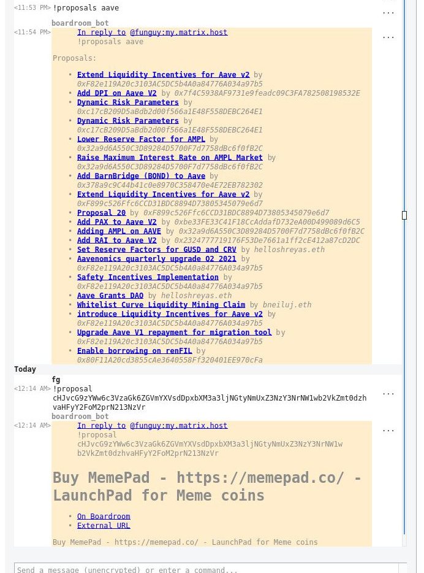

# matrix-bot-boardroom

Get proposals, votes, and voter information from [Boardroom](https://boardroom.info/) straight to your Matrix server.



## Requirements

This is a developer-only tool at the moment and has not been packaged in a friendly way. You will need:

* Node 14
* A Matrix server you can register with:
  * If you want to test this locally, use [this Docker Compose setup](https://github.com/0xcharchar/matrix-synapse-server-docker-compose)
* Rooms to join
* An API token for [Alchemy](https://www.alchemy.com/)

## Setup

1. Clone the repository
2. Create a `.env` file in the root of the project, filling in these variables
    ```sh
    MATRIX_HOMESERVER_URL=http://localhost:8008
    MATRIX_BOT_USERNAME=boardroom_bot
    MATRIX_BOT_PASSWORD=demobot
    PROVIDER_TOKEN_ALCHEMY=
    ```
3. Install dependencies with `npm i`

## Usage

Starting the bot for the first time will register it.

1. Start the bot: `npm run dev`
2. In the Matrix client of your choice, invite **@boardroom_bot:your.server.com**
3. Run any of the [commands](#commands) to get some results

## Commands

### `!proposals <protocol>`

Prints the last 25 proposals from given protocol. Each proposal will have the proposer address or ENS, the title of the proposal, and a link back to Boardroom

### `!proposal <refId>`

Get the details of a single proposal.

